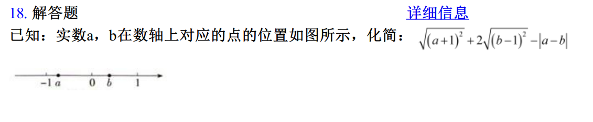
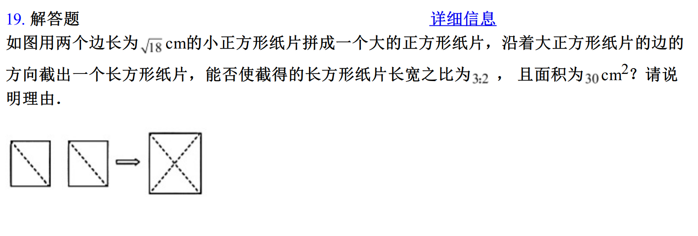

## 2024-09-04

### Assignment & done

- English
  1. ...

- Math
  1. _**cambridge-senior-mathematics-vce-general-mathematics-vce-units-1-amp-2**_
     > P15-P20...

  2. _**（人教版）2021-2022学年度第二学期七年级数学6.3实数 期末复习测试卷**_ ✔

     > incorrect or unclear

     \
     \
     

     > explain

     13 - 顺时针滚动与逆时针滚动都要考虑，答案不唯一\
     18 -\
     19 -

- Chinese
  1. ...

### Note

=====================================================================================

## 2024-09-05

### Assignment & done

- English
  1. ...

- Math
  1. _**cambridge-senior-mathematics-vce-general-mathematics-vce-units-1-amp-2**_
     > P15-P20...

  2. _**（人教版）2021-2022学年度第二学期七年级数学第5.3平行线的性质期末复习测试卷**_
     > incorrect or unclear

     > explain

- Chinese
  1. _**VCE中文-小学版-第八册**_
     > 阅读 12.《特别的演出》 ✔\
     > 生字 12.《特别的演出》...\
     > 阅读 《食草动物》...\
     > 生字 《食草动物》...
  2. _**中国文化常识**_
     > 阅读 民族篇 高山族 ...\
     > 阅读 民俗篇 概述 ...
  3. _**思维导图速记汉字**_
     > P1-P4 ...

### Note
