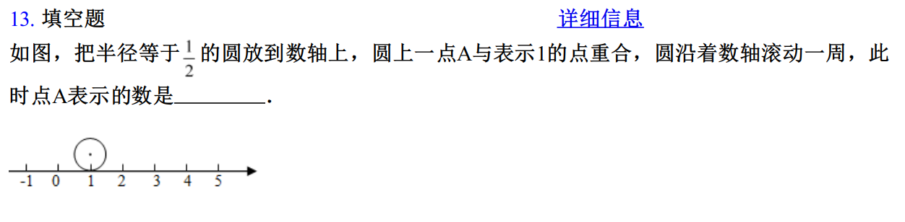

## 2024-09-04

### Assignment & done

- English
  1. TBA

- Math
  1. _**cambridge-senior-mathematics-vce-general-mathematics-vce-units-1-amp-2**_
     > P15-P20

  2. _**（人教版）2021-2022学年度第二学期七年级数学6.3实数 期末复习测试卷**_

     > incorrect or unclear

     

     > explain

     顺时针滚动与逆时针滚动都要考虑，答案不唯一

- Chinese
  1. reading

### Note
